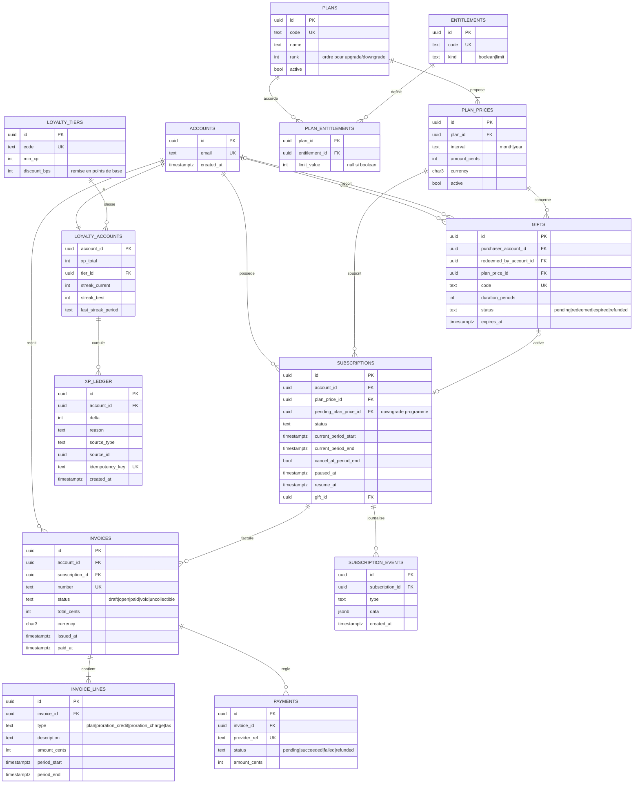
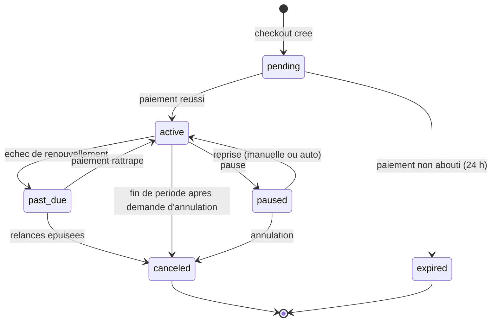

# ADR-001 : Plans, abonnements, droits, factures et fidélité

- **Statut** : Proposé
- **Date** : 2026-10-06
- **Périmètre** : `apps/api` (logique + Postgres). `apps/web` consomme l'API ; `packages/ui` reste présentationnel.
- **Issues** : [ADR-001-issues.md](./ADR-001-issues.md) (18 issues)

## Contexte

Le portail doit gérer des plans payants (mensuels/annuels), le cycle de vie d'un abonnement (souscription,
changement de plan avec prorata, pause, reprise, annulation), des droits (entitlements) dérivés du plan, des factures,
des abonnements offerts (cadeau) et un programme de fidélité (XP, paliers, séries). Aucun modèle n'existe encore :
`apps/api` ne contient que la config, l'accès base et `/health` / `/ready`.

## Décisions

1. **Montants en entiers (centimes) + code devise ISO 4217.** Jamais de flottants. Arrondi : half-up au centime,
   appliqué une seule fois par ligne de facture.
2. **Prix immuables.** Un `plan_price` n'est jamais modifié : on en crée un nouveau et on désactive l'ancien.
   Un abonnement référence le `plan_price` souscrit (grandfathering par construction).
3. **Droits = données, pas du code.** `entitlements` (catalogue) + `plan_entitlements` (valeur par plan).
   L'API expose les droits effectifs ; le web ne déduit jamais un droit du nom du plan.
4. **Machine à états explicite** pour `subscriptions.status`, toute transition écrit un `subscription_events`
   (journal append-only, source d'audit).
5. **Factures immuables une fois `open`.** Correction = avoir (`credit_note`) ou nouvelle facture, jamais un `UPDATE`.
6. **Prorata au jour**, calculé sur la période de facturation en cours (voir « Règles métier »).
7. **Fidélité = journal append-only** (`xp_ledger`) ; le total et le palier sont des projections recalculables.
   Idempotence par `idempotency_key` unique.
8. **Fournisseur de paiement derrière un port** (`PaymentProvider`, injecté comme `Database`). Les webhooks sont
   idempotents (table `payment_events` avec clé unique `provider_event_id`). Choix du fournisseur : hors ADR.
9. **Temps injecté** (`Clock`) pour rendre testables prorata, pause, séries et expirations.

## Modèle de données

Détails non représentés dans le diagramme : contraintes `CHECK (amount_cents >= 0)` sur prix, une seule
souscription « vivante » (`pending|active|paused|past_due`) par compte via index unique partiel,
`current_period_end > current_period_start`, `xp_ledger.delta <> 0`.

## Cycle de vie d'un abonnement

## Règles métier

**Droits.** Droits effectifs = `plan_entitlements` du plan de l'abonnement `active` ou `past_due` (période de grâce
de 7 jours). `paused`, `canceled` (après `current_period_end`) et `expired` n'accordent aucun droit payant.

**Upgrade (immédiat, avec prorata).** Soit `P` la durée de la période en jours, `r` les jours restants
(arrondis au jour supérieur), `old` / `new` les prix par période :

- crédit = `round(old × r / P)`, débit = `round(new × r / P)` ;
- une facture avec deux lignes (`proration_credit` négative, `proration_charge`) est émise immédiatement ;
- le plan change à la confirmation du paiement ; `current_period_end` reste inchangé.
- Si l'upgrade change d'intervalle (mois → an), une nouvelle période démarre et le crédit restant est déduit
  de la facture annuelle.

**Downgrade.** Jamais de remboursement : programmé via `pending_plan_price_id`, appliqué au renouvellement.

**Pause.** Autorisée depuis `active`, durée max 90 jours, 1 pause par période de 12 mois. Facturation suspendue,
droits suspendus. À la reprise (manuelle ou à `resume_at`), une nouvelle période démarre à la date de reprise
(pas de prorata, pas de période gratuite cumulée).

**Annulation.** Par défaut `cancel_at_period_end = true` : droits conservés jusqu'à `current_period_end`, aucun
remboursement. Annulable (révocable) tant que la période n'est pas terminée.

**Cadeau.** L'achat crée une facture payée par l'offrant et un `gift` `pending` avec un code unique non devinable
(≥ 128 bits d'entropie), valable 12 mois. La rédemption crée une souscription `active` sans paiement récurrent
pour `duration_periods`, puis s'arrête (`canceled` à terme, pas de renouvellement automatique). Un compte avec un
abonnement vivant ne peut pas échanger un cadeau (il est mis en file : hors périmètre, voir questions ouvertes).

**Fidélité.** (valeurs initiales, à confirmer)

| Événement | XP |
|---|---|
| Facture payée | 10 XP par euro payé (arrondi inférieur), cadeaux inclus pour l'offrant |
| Bonus de série | +50 XP à chaque 3ᵉ période consécutive |
| Remboursement / avoir | XP correspondants retirés (écriture négative) |

| Palier | Seuil XP | Avantage |
|---|---|---|
| Bronze | 0 | — |
| Argent | 500 | 2 % de remise au renouvellement |
| Or | 2 000 | 5 % |
| Platine | 5 000 | 10 % |

Les paliers ne descendent pas pendant 12 mois après l'obtention (pas de rétrogradation sur remboursement unique).
**Série (streak)** : nombre de périodes de facturation consécutives payées dans les délais (sans passage en
`past_due`). Une pause **gèle** la série (ni +1 ni remise à zéro) ; un `past_due` non rattrapé la remet à 0.
`streak_best` n'est jamais décrémenté.

## Contrats API (esquisse)

| Méthode | Route | Rôle |
|---|---|---|
| GET | `/plans` | Catalogue public (plans, prix actifs, droits) |
| GET | `/me/entitlements` | Droits effectifs |
| POST | `/subscriptions` | Checkout |
| POST | `/subscriptions/:id/change-plan` | Upgrade immédiat / downgrade programmé |
| POST | `/subscriptions/:id/pause` · `/resume` · `/cancel` | Cycle de vie |
| GET | `/invoices`, `/invoices/:id` | Historique |
| POST | `/gifts` · `/gifts/:code/redeem` | Cadeau |
| GET | `/me/loyalty` | XP, palier, série |
| POST | `/webhooks/payments` | Événements du fournisseur (signature vérifiée, idempotent) |

## Conséquences

**Positives** : historique auditable, prorata déterministe et testable, droits modifiables sans déploiement,
fidélité recalculable.
**Négatives** : plus de tables et de jointures ; la cohérence facture/paiement/abonnement exige des transactions
(`Database` doit exposer une transaction) ; le journal XP grossit sans borne (partitionnement à envisager plus tard).

**Déploiement** : migrations additives uniquement (aucune table existante). Rollback : migration `down` supprimant
les nouvelles tables. Nouvelles variables attendues : clés du fournisseur de paiement et secret de webhook
(secrets Fly, lus uniquement via `loadConfig`). À documenter dans `docs/DEPLOY.md` à l'implémentation.

## Alternatives écartées

- **Prix modifiables sur le plan** : casse l'historique et le grandfathering.
- **Droits codés en dur par plan** : un changement de catalogue impose un déploiement.
- **XP calculé à la volée depuis les factures** : lent, et les règles changeantes réécrivent le passé.
- **Prorata à la seconde** : arrondis difficiles à expliquer au client ; le jour suffit.

## Questions ouvertes

1. Fournisseur de paiement (Stripe ? autre) et gestion de la TVA / taxes.
2. Cadeau à un compte déjà abonné : file d'attente, prolongation ou refus ?
3. Valeurs exactes XP, seuils de paliers et remises (proposées ci-dessus).
4. Période de grâce `past_due` (7 jours proposés) et nombre de relances.
5. Authentification : `accounts` suppose un fournisseur d'identité à définir (hors ADR).
